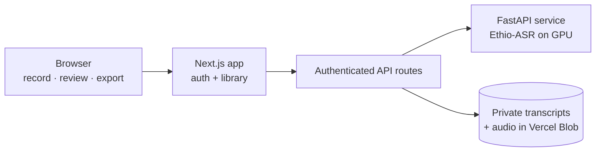

<div align="center">


<a href="https://naibtech.dev">
  
</a>

[](https://naibtech.dev)
[](https://www.linkedin.com/in/naib-mehari-95690114a/)
[](mailto:naibmehari@gmail.com)
[](https://naibtech.dev/Naibe-Mehari-CV.pdf)


<br>

[**About**](#-about) · [**Flagship**](#-flagship-habeshavoice-studio) · [**Projects**](#-projects) · [**Stack**](#-stack) · [**Stats**](#-stats) · [**Contact**](#-contact)

</div>

---

## 👋 About

I'm a full-stack developer at **Anzyz Technologies**, building Python / FastAPI backends with MongoDB, Celery and Elasticsearch — document ingestion and NLP that maps how concepts and themes connect. Before that I was a software engineer at **Red Rock** (Aug 2025 – Jun 2026), where I built a live PLC data tool in C# / .NET 8 on Avalonia and Beckhoff TwinCAT ADS.

I finished my B.Eng. in Computer Engineering at the **University of Agder** in June 2026 and am now studying for a **Master's in Cybersecurity**.

Outside work I build things nobody handed me a spec for: a speech studio for my own language, an interpretable-ML research lab, and a 3D walk through a church I'd love people to see.

```csharp
var naibe = new Engineer
{
    DayJob    = "Full-stack @ Anzyz — Python · FastAPI · MongoDB · Celery · Elasticsearch",
    Before    = "Industrial software @ Red Rock — Avalonia · TwinCAT ADS",
    Studying  = "Master's in Cybersecurity",
    Nights    = new[] { "Speech AI (Tigrinya/Amharic)", "Tsetlin Machine research", "Three.js" },
    Backbone  = new[] { "C# / .NET 8", "TypeScript", "Python" },
    Tongues   = new[] { "Norsk", "English", "ትግርኛ", "العربية" },
    Likes     = "Systems that are tested, explainable, and finished.",
};
```

---

## 🎙️ Flagship: HabeshaVoice Studio

> A private speech-to-text workspace for **Tigrinya and Amharic** — languages that mainstream tools barely support.

[**Source →**](https://github.com/naibwedi/habeshavoice-studio)

- **Record or upload**, listen back, then transcribe — audio leaves the browser only after explicit consent
- **Review workflow** — edit the working transcript while the original machine transcript is kept for reference
- **Private library** — searchable sessions, export to TXT / Markdown / PDF
- **Split architecture** — web app on a standard host, GPU inference in a separate FastAPI service; the service credential never reaches the browser



`Next.js` · `TypeScript` · `FastAPI` · `Python` · `Vercel Blob` · `CI: typecheck + test + build`

---

## 🚀 Projects

### 🧠 AI & Machine Learning

| Project | What it is | Stack | Links |
|---|---|---|---|
| **HabeshaVoice Studio** | Speech-to-text product for Tigrinya & Amharic | Next.js · FastAPI · Ethio-ASR | [Live](https://habeshavoice-studio.vercel.app) · [Source](https://github.com/naibwedi/habeshavoice-studio) |
| **Tsetlin Market Lab** | Predicts the *next bookmaker price move* with a Tsetlin Machine vs XGBoost/LightGBM baselines — leakage-safe, time-ordered splits, cron-collected data, human-readable clauses. Research, not betting tips. | Python · tmu · GitHub Actions | [Source](https://github.com/naibwedi/tsetlin-market-lab) |
| **LogicAlpha** | Purged walk-forward strategy selection with Boolean features, cost-aware backtests and an optional Tsetlin Machine | Python | [Source](https://github.com/naibwedi/logic-alpha-tm) |
| **Tsetlin Trader** | Interpretable trading engine — Tsetlin Machine rule-based signals executed as paper trades through a pluggable broker interface; every decision ships with the human-readable logic behind it | Python | [Source](https://github.com/naibwedi/tsetlin-trader) |
| **Decidon** | Fuses multiple decision engines (ML models, rules) into one calibrated, replayable verdict | Python | [Source](https://github.com/naibwedi/decidon) |
| **CampusCart** | Student marketplace whose uploads pass a Cloud Vision moderation pipeline that deletes flagged images and notifies the seller | React Native · Firebase · Cloud Functions | [Source](https://github.com/naibwedi/Campus-Cart-App) |

### 🌐 Web & Creative

| Project | What it is | Stack | Links |
|---|---|---|---|
| **Selam — A Sacred Journey** | Walk from a courtyard into an Eritrean Orthodox-inspired church: guided tour, candlelight mode, ambient sound, reduced-motion option | Three.js · Web Audio | [Live](https://eritrea-sacred-journey.vercel.app) · [Source](https://github.com/naibwedi/eritrea-sacred-journey) |
| **Tigrigna → Latin** | Geez (ግዕዝ) script and numerals to Latin, client-side | HTML · CSS · JS | [Live](https://tigrigna-latin.netlify.app/) · [Source](https://github.com/naibwedi/Tigrigna-to-latin-traslator) |
| **This portfolio** | Hand-written, no framework, respects reduced-motion | HTML · CSS · JS | [Live](https://naibtech.dev) · [Source](https://github.com/naibwedi/naibe-portfolio) |

### 🖥️ Backend, Desktop & Mobile

| Project | What it is | Stack | Links |
|---|---|---|---|
| **Logi-Track** | Logistics platform — four roles, trip lifecycle, live status via SignalR, Identity, Swagger, Docker | ASP.NET Core · EF Core · SignalR | [Source](https://github.com/naibwedi/Logi-Track) |
| **FlowLingo** | Android translation keyboard — native Kotlin IME plus Flutter settings shell | Kotlin · Flutter | [Source](https://github.com/naibwedi/FlowLingo) |
| **Student Assessment App** | Grade & assessment tracking for teachers | React Native · Firebase | [Source](https://github.com/naibwedi/Student-Assesment-App) |
| **ADS Parameter Tool** | Reads live PLC symbols over TwinCAT ADS and visualises them (Red Rock — private) | C# · Avalonia · ReactiveUI | — |

### 🛡️ Security

| Project | What it is | Stack | Links |
|---|---|---|---|
| **Cross-Site Scripting demo** | A deliberately vulnerable Flask app plus an attacker server, showing an XSS attack end to end — including credential theft through a fake login page. Dockerised so it runs in isolation. | Flask · SQLite · Docker Compose | [Source](https://github.com/naibwedi/Cross-Site-Scripting) |
| **User Authentication** | Hashed credentials (bcrypt), brute-force protection with rate limiting, TOTP two-factor auth, and an OAuth2 authorization-code flow | Flask · SQLite · Docker | [Source](https://github.com/naibwedi/User-Authentication) |

### ⚙️ Systems & Fundamentals

| Project | What it is | Links |
|---|---|---|
| **x86 OS from scratch** | Bootloader, interrupts, memory management (UiA IKT218) | [Source](https://github.com/naibwedi/2025-ikt218-osdev) |
| **Mbed OS embedded** | Microcontroller I/O and real-time tasks | [Source](https://github.com/naibwedi/Mbed-OS-project-) |
| **Infix → Postfix** | Stack-based expression evaluator with trig, log, variables | [Source](https://github.com/naibwedi/infix-to-postfix-converter) |

---

## 🛠️ Stack

<div align="center">


</div>

| | |
|---|---|
| **Languages** | C#, TypeScript, Python, C++, C, JavaScript, Dart, Kotlin |
| **Backend** | FastAPI, ASP.NET Core, EF Core, SignalR, Flask, REST, Celery, MongoDB, Elasticsearch |
| **Frontend / Mobile** | React, Next.js, React Native, Expo, Flutter, Three.js |
| **Industrial / Desktop** | Avalonia UI, ReactiveUI (MVVM), Beckhoff TwinCAT ADS |
| **Data & ML** | Tsetlin Machines, scikit-learn, XGBoost, LightGBM, leakage-safe pipelines |
| **Security** | XSS exploitation & defence, bcrypt, TOTP 2FA, OAuth2, brute-force protection (MSc in progress) |
| **Ops** | Docker, GitHub Actions, GitLab CI, Vercel |

---

## 📊 Stats

<div align="center">


</div>

---

## 📫 Contact

Open to software engineering opportunities — full-stack (Python / .NET), applied AI, or security.

**[naibtech.dev](https://naibtech.dev)** · **[LinkedIn](https://www.linkedin.com/in/naib-mehari-95690114a/)** · **naibmehari@gmail.com**

<div align="center">

</div>
